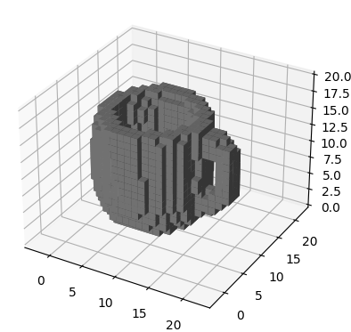
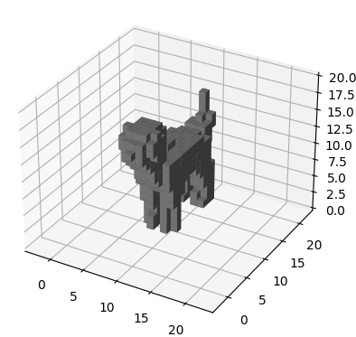

# VoxelShapeGenerator

A simple voxel shape generator based on [Shap-E](https://github.com/openai/shap-e)

<table>
    <tbody>
        <tr>
            <td align="center">
                
            </td>
            <td align="center">
                
            </td>
            <td align="center">
                
            </td>
        </tr>
    </tbody>
<table>

## Install

```
bash install.sh
```

## Generate shapes

```
venv/bin/python shape_gen.py
```

Modify `prompts.txt`, each line is a prompt for a target shape. A snapshot of the generates shape will be stored
as `shapes/<prompt>.png` and the voxel file (A 3D numpy array) will be stored as `shapes/<prompt>.npy`